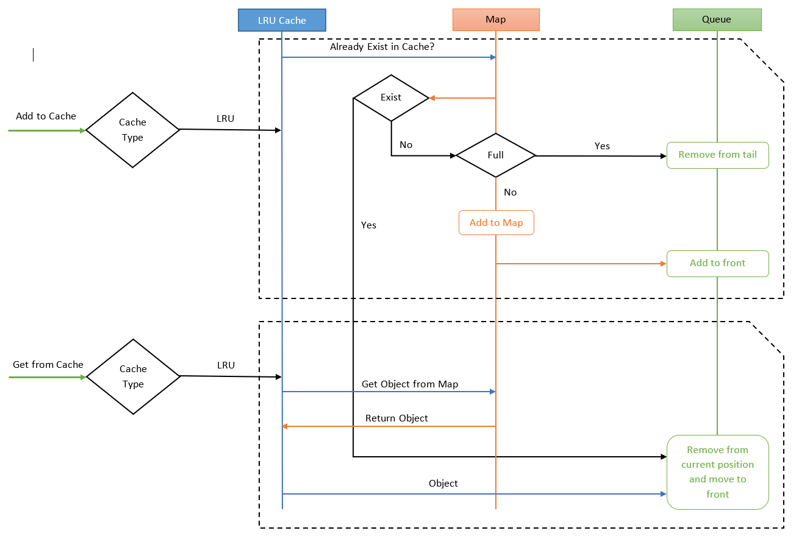
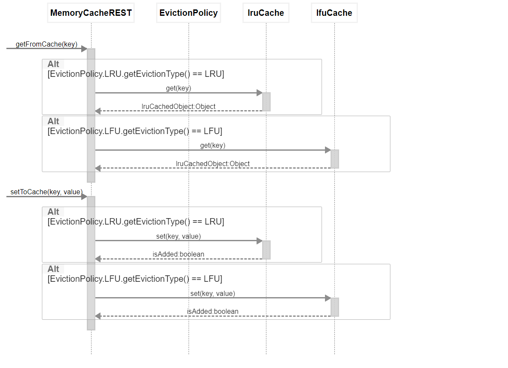

# In Memory Cache (LRU / LFU)

This is an implementation of LRU(Least Recently Used) and LFU(Least Frequently Used) eviction
strategy for an in memory cache. All the cache operations exposed via REST endpoints.

#### Technologies used

|Technology  |Version         |Reason                                  |
|------------|:---------------|----------------------------------------|
|Sprint boot |2.3.0.RELEASE   | Easy to create a deployable REST API.  |
|Gradle      |6.4.1           | To build the project (jar)             |
|lombok      |1.18.12         | Avoid redundant code and make them available at compile time |
|jacoco      |latest          | Generate test result and coverage reports |
|Junit       |5.6.2           | for the unit testing                   |

#### High level architecture diagram for LRU



#### Design decision explanation

* LRU
    Implemented using Java Map with an Integer type object key that maps to wrapper custom object which holds any kind of data object inside the node.
    Can gain constant time for `get()` and `put()` operations in the worst scenario.
    
    **Time complexity:**
    * put() - O(1)
    * get() - O(1)
    
    **Space complexity:**
    * O(n), 2*n, n is number of nodes.
    
* LFU
    Implemented using three Java Maps with an Integer type object key that maps java Object which holds any kind of data object inside the node.
    To hold frequencies of an Object and keep track of same frequency Object keys separately.
    Can gain constant time for `get()` and `put()` operations in the worst scenario.
    
    **Time complexity:**
    * put() - O(1)
    * get() - O(1)
    
    **Space complexity:**
    * O(n), 3*n, n is number of nodes.
    
#### LRU sequence diagram of implementation flow.



# Configuration guide
We can configure once our cache before build the application in a configuration.
Can configure cache type (lru/lfu) and each cache type capacity(size should be a positive integer).
There is a file `cacheConfig.properties` at `src/main/resources/`
We can change any property as bellow example.

```properties
cache.eviction_policy=lru
cache.lru.max_capacity=5
cache.lfu.max_capacity=5
```

# How to build and Run

#### Build with gradle wrapper
In the project root there is `gradlew.bat` and `gradlew.sh` file. 
Now just run following command.

**Linux**
> ./gradlew clean build

**Windows**
> gradlew.bat clean build

#### Let's run now
Now after build successful `build` folder will be created. Inside that folder
there is a `in-memory-cache-0.0.1-SNAPSHOT.jar` file at the path: `./build/libs`
No execute the following command.

> java -jar in-memory-cache-0.0.1-SNAPSHOT.jar

Now application will up and running on `port 9090`. Available for REST API
calls.

# How to Run test and See coverage.
Using jacoco plugin we can execute all the unit tests and generate the coverage reports.

**Note:** currently test are written only for LRU cache implementation.

Run the following command to get test coverage report.

**Linux**
> ./gradlew clean build jacocoTestReport

**Windows**
> gradlew.bat clean build jacocoTestReport

Now `index.html` format report generated at `./build/reports/jacoco/test/html` folder.

# Getting Started with REST API

* GET - get the any cached object from its integer KEY.

    `http://localhost:9090/api/cache/{KEY}`

* POST - add any object with an integer KEY. Object can be any kind of JSON payload.
         
     **Content-Type** - application/json
         
    `http://localhost:9090/api/cache/{KEY}`
    
* GET - get the current cache size.

    `http://localhost:9090/api/cache/size`
    
* GET - check available objects in the cache.

    `http://localhost:9090/api/cache/check`
    
* GET - clear the entire cache.

    `http://localhost:9090/api/cache/clear`

